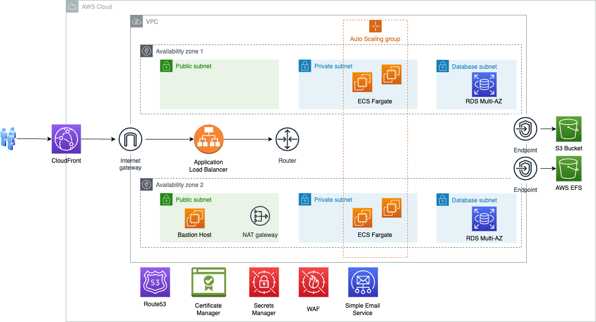

# WordPress AWS Infrastructure

- [Overview](#Overview)
- [Files](#Files)
- [Architecture](#Architecture)
- [Deployment](#Deployment)
- [Post-Deployment](#Post-Deployment)
- [Costs](#Costs)

## Overview

This project contains a set of AWS CloudFormation templates designed to deploy a highly available and scalable WordPress environment on AWS. The architecture is designed to provide a robust foundation for WordPress installations, using AWS best practices for security and efficiency.

## Files

- **wordpress-aws-vpc.yaml**: Sets up the necessary network infrastructure for WordPress installations. This includes a VPC, Internet and NAT Gateways, ACLs, and more. It can support a group of different WordPress websites or separate network infrastructures for each setup if necessary.

- **wordpress-aws-ssl-certificate.yaml**: Handles the request and issuance of SSL certificates for each WordPress installation. Certificates must be requested and issued before initiating WordPress installation.

- **wordpress-aws-ecs-fargate.yaml**: Creates a complete high-availability and auto-scalable infrastructure with WordPress. This template provisions AWS services including CloudFront as a CDN solution, ECS Fargate for cost efficiency and scalability, EFS for file storage, etc. You can use any available WordPress Docker images or create your own.

## Architecture

Here is a visual representation of the solution architecture: 



## Deployment

1. **Network Infrastructure**:
    - Deploy the `wordpress-aws-vpc.yaml` template to set up the network infrastructure.
    - Parameters: Provide any necessary parameters as per your requirements.

2. **SSL Certificate**:
    - Deploy the `wordpress-aws-ssl-certificate.yaml` template to request SSL certificates.
    - Ensure the domain names are correctly set, and validate the certificates once issued.

3. **WordPress on ECS Fargate**:
    - Deploy the `wordpress-aws-ecs-fargate.yaml` template to create the WordPress infrastructure.
    - Configure parameters like image names, instance sizes, and scaling policies as needed.

## Post-Deployment

- **DNS Configuration**: Update your DNS records to point to the CloudFront distribution and ensure SSL/TLS works as expected.
- **WordPress Configuration**: Access your WordPress site to complete the installation and setup.
- **Monitoring & Management**: Set up CloudWatch alarms and monitoring based on your operational needs.

## Costs

This guide provides an overview of AWS Cost Allocation Tags and instructions on how to implement and use them to track your AWS infrastructure costs.

### What are AWS Cost Allocation Tags?

AWS Cost Allocation Tags are key-value pairs that you can attach to AWS resources. They enable you to organize and track your AWS costs. When you activate these tags, AWS uses them to categorize costs on your cost allocation report, making it easier to see the cost distribution across different projects, departments, or environments.

### Step 1: Tag AWS Resources

AWS CloudFormation templates automatically add TAG **project** with appropriate value from CloudFormation template parameter **WordpressName** - a unique string to identify each Wordpress installation. 

### Step 2: Activate the Tag for Cost Allocation

#### Open the Billing Dashboard:
- Go to the AWS Management Console.
- Open the 'Billing & Cost Management Dashboard'.

#### Activate the Tag:
- Navigate to 'Cost Allocation Tags'.
- Under 'User-Defined Cost Allocation Tags', find the project tag.
- Select the tag and click 'Activate'.

### Step 3: Creating a Cost Report by Project Tag

#### Open the Cost Explorer:
- In the Billing Dashboard, go to 'Cost Explorer'.

#### Create a New Report:
- Click on 'Create a new report'.
- Choose the type of report (e.g., 'Costs').
- Under 'Group by', select 'Tag' and choose the project tag.
- Configure other report settings as needed.
- Save and view the report.

### Viewing Infrastructure Cost Information in AWS Web Management Console

#### Access the Cost Explorer:
- In the AWS Management Console, go to the Billing Dashboard.
- Click on 'Cost Explorer'.

#### Use Cost Explorer's Filters:
- Use the filters to narrow down by specific tags, services, or time range.
- Analyze the cost associated with different projects.

### Retrieving Infrastructure Cost Information via AWS CLI

#### Install and Configure AWS CLI:
- Ensure AWS CLI is installed and configured with the necessary permissions.

#### Use the get-cost-and-usage Command:
- Run the following command:

```
   aws ce get-cost-and-usage --time-period Start=YYYY-MM-DD,End=YYYY-MM-DD --granularity MONTHLY --filter "{\"Tags\":{\"Key\":\"project\",\"Values\":[\"<your_project_name>\"]}}" --metrics "UnblendedCost"
```

- Replace YYYY-MM-DD with the start and end dates, and <your_project_name> with your project's name.


