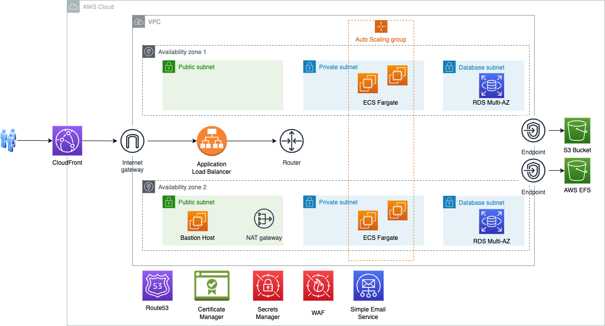

# WordPress AWS Infrastructure

This project contains a set of AWS CloudFormation templates designed to deploy a highly available and scalable WordPress environment on AWS. The architecture is designed to provide a robust foundation for WordPress installations, using AWS best practices for security and efficiency.

## Files

- **wordpress-aws-vpc.yaml**: Sets up the necessary network infrastructure for WordPress installations. This includes a VPC, Internet and NAT Gateways, ACLs, and more. It can support a group of different WordPress websites or separate network infrastructures for each setup if necessary.

- **wordpress-aws-ssl-certificate.yaml**: Handles the request and issuance of SSL certificates for each WordPress installation. Certificates must be requested and issued before initiating WordPress installation.

- **wordpress-aws-ecs-fargate.yaml**: Creates a complete high-availability and auto-scalable infrastructure with WordPress. This template provisions AWS services including CloudFront as a CDN solution, ECS Fargate for cost efficiency and scalability, EFS for file storage, etc. You can use any available WordPress Docker images or create your own.

## Solution Architecture

Here is a visual representation of the solution architecture: 

## Prerequisites

- AWS Account with the necessary permissions to create the resources described in the templates.
- Familiarity with AWS CloudFormation, ECS, EFS, RDS Aurora, and other AWS services.

## Deployment Steps

1. **Network Infrastructure**:
    - Deploy the `wordpress-aws-vpc.yaml` template to set up the network infrastructure.
    - Parameters: Provide any necessary parameters as per your requirements.

2. **SSL Certificate**:
    - Deploy the `wordpress-aws-ssl-certificate.yaml` template to request SSL certificates.
    - Ensure the domain names are correctly set, and validate the certificates once issued.

3. **WordPress on ECS Fargate**:
    - Deploy the `wordpress-aws-ecs-fargate.yaml` template to create the WordPress infrastructure.
    - Configure parameters like image names, instance sizes, and scaling policies as needed.

## Post-Deployment

- **DNS Configuration**: Update your DNS records to point to the CloudFront distribution and ensure SSL/TLS works as expected.
- **WordPress Configuration**: Access your WordPress site to complete the installation and setup.
- **Monitoring & Management**: Set up CloudWatch alarms and monitoring based on your operational needs.

## Best Practices

- **Security**: Review and apply the necessary security groups and IAM roles.
- **Backup**: Implement backup strategies for your WordPress content and database.
- **Cost Management**: Monitor your AWS usage and adjust resource sizes and scaling policies as necessary.

## Support & Troubleshooting

- For issues related to CloudFormation or specific AWS services, consult the [AWS Documentation](https://aws.amazon.com/documentation/) or contact AWS Support.
- For general questions or community support, consider AWS forums or other community platforms.
